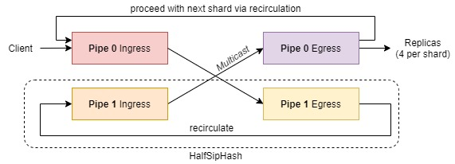

# NeoBFT

This repository holds the data plane implementation for NeoBFT.

## Dependencies

> Note: It is assumed that there is access to the Intel P4 Studio SDE version 9.7.0 and the ICA tools helper scripts.

The P4 Studio SDE is assumed to be placed in your home directory, i.e., `$HOME/bf-sde-9.7.0`, and also the tools at `$HOME/tools`.
Before proceeding, make sure that you have loaded the necessary environment variables with `source ~/tools/set_sde.bash`.

## Evaluating NeoBFT
First, compile both the data plane programs for HMAC and FPGA by doing `make`.

### AOM-HM
Start the AOM-HM switch program: `$SDE/run_switchd.sh -p tom_hmac`.
Then, setup the program using `./setup_hmac.sh`.

#### Data Plane Design
In the following diagram, we show the AOM-HM switch design.
For every incoming AOM packet, it is forwarded to the AOM pipeline (pipe 1) for processing (via recirculation).
Once it is done, it will be forwarded back and multicasted at pipe 0.
If there are more than four replicas, it will be recirculated at pipe 0, and computes the HMAC for the subsequent four replicas (or next "shard").
Refer to the paper for more details.



### AOM-PK
Start the FPGA switch program: `$SDE/run_switchd.sh -p tom_fpga`.
Then, setup the program using `./setup_fpga.sh`.


## Microbenchmarks
To run the microbenchmarks (Figure 4, 5 and 6 in the paper), there are a few things that needs to be done.
First, recompile all the data plane programs, do `make debug`.

To measure the latency, we will use the switch's packet generator feature to generate packets and the packets delivered to the replicas will have contain the latency numbers in the Ethernet headers.

### P4 Programs
#### AOM-HM
Similarly, start the HMAC switch program: `$SDE/run_switchd.sh -p tom_hmac`.
Then, setup the program using `./setup_hmac.sh`.

#### AOM-PK
Similarly, start the FPGA switch program: `$SDE/run_switchd.sh -p tom_fpga`.
Then, setup the program using `./setup_fpga.sh`.

### Packet Generation
#### AOM-HM
Configure the packet generator: `./pktgen_hmac.sh`.
This uses the `run_pd_rpc.py` script.

To start packet generation, type the command `pktgen.app_enable(1)`.
Once you are done, make sure to disable it with `pktgen.app_disable(1)`.

To exert different loads, look into `control/neo_pktgen_hmac.py`, and use the corresponding `app_cfg.timer`, e.g., 13 for 98-99% load (no packet losses).

Repeat this for all three loads, i.e., 25%, 50%, and 99%.

#### AOM-PK
Configure the packet generator: `./pktgen_fpga.sh`.
This uses the `run_pd_rpc.py` script.

To start packet generation, type the command `pktgen.app_enable(1)`.
Once you are done, make sure to disable it with `pktgen.app_disable(1)`.

To exert different loads, look into `control/neo_pktgen_hmac.py`, and use the corresponding `app_cfg.timer`, e.g., 900 for 99% load (no packet losses).

Repeat this for all three loads, i.e., 25%, 50%, and 99%.

### Collecting the Results
> IMPORTANT: We only capture the results on the FIRST replica.
We assume `ens1f0` as the network interface.

#### AOM-HM
To get the numbers, do the following:
```bash
# capture the NeoBFT HMAC-signed packets, you can stop capturing after 10 seconds
sudo tcpdump -i ens1f0 | grep -e "00:00:00:" > extracted.log

# we are only interested in the Ethernet header's source address
awk -F ' ' '{print $6}' extracted.log > values.log

# finally, copy and name the file for further processing (hmac99, hmac50, hmac25)
cp values.log results/results_hmac99.log
```

#### AOM-PK
To get the numbers, do the following:
```bash
# capture the FPGA-signed NeoBFT packets
sudo tcpdump -i ens1f0  -e udp[5] != 0 and udp[32] != 0 and udp[33] != 0  > extracted.log

# we are only interested in the Ethernet header's source address
awk -F ' ' '{print $6}' extracted.log > values.log

# finally, copy and name the file for further processing (fpga99, fpga50, fpga25)
cp values.log results/results_fpga99.log
```

### Processing the Results (CDF Plots - Figure 4, and 5)
After all 6 runs, you should have the following files: `results_hmac25.log, results_hmac50.log, results_hmac99.log, results_fpga25.log, results_fpga50.log, results_fpga99.log`.

Create a `results/` folder within this repository, then copy the logs files to this folder.

Then, we can now reproduce Figure 4 and 5, do `python3 plot_cdf_hmac.py results/` and `python3 plot_cdf_fpga.py results/`.

For reference, we included some sample results in `sample_results`.


### Getting the Throughput Curve (Figure 6)
While running the aforementioned experiments with different loads, we get the instantaneous throughput from the switch's terminal.
Under the port management subsection, do `rate-period 1`, followed by `rate-show`.

```
bf-sde.pm> rate-period 1
bf-sde.pm> rate-show
-----+----+---+----+-------+---+-------+-------+---------+---------+----+----
PORT |MAC |D_P|P/PT|SPEED  |RDY|RX Mpps|TX Mpps|RX Mbps  |TX Mbps  |RX %|TX %
-----+----+---+----+-------+---+-------+-------+---------+---------+----+----
9/0  |15/0|  0|0/ 0|100G   |UP |   0.00|   1.11|     0.00|  1634.02|  0%|  1%
... [Output omitted]
```

We get the throughput by observing the first replica's TX rate (see TX Mpps column).
From this example, we see the 1.11Mpps TX rate that can be handled by the FPGA at 99% load.

Similarly, you should observe ~76.24Mpps for the HMAC case, as below:
```
bf-sde.pm> rate-show
-----+----+---+----+-------+---+-------+-------+---------+---------+----+----
PORT |MAC |D_P|P/PT|SPEED  |RDY|RX Mpps|TX Mpps|RX Mbps  |TX Mbps  |RX %|TX %
-----+----+---+----+-------+---+-------+-------+---------+---------+----+----
9/0  |15/0|  0|0/ 0|100G   |UP |   0.00|  76.25|     0.00| 54904.47|  0%| 54%
... [Output omitted]
```

To plot the throughput curves, do `python3 plot_tput.py HMAC_TPUT FPGA_TPUT`, example: `python3 plot_tput.py 76.25 1.11`.
This will reproduce the plots in Figure 6.

Note that AOM-PK's throughput remains constant regardless of the number of replicas, while AOM-HM's reduces by half for every increase in four replica.


